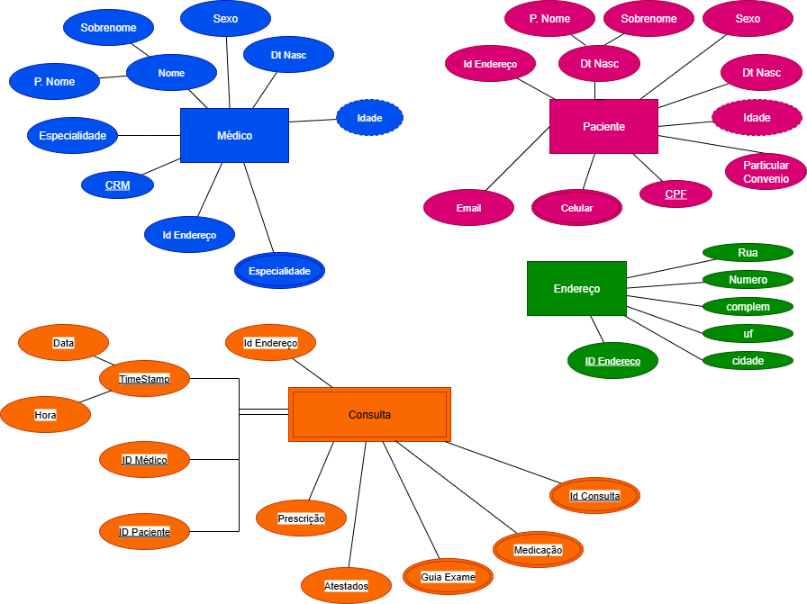

## Descrição do Projeto Cafeteria Express

# Café Aroma ☕🌱  
### Microprodução Sustentável de Café Especial em São Lourenço da Serra (SP)

## Visão Geral  
O **Projeto Café Aroma** nasce com o propósito de unir tradição cafeeira, inovação tecnológica e práticas sustentáveis para produzir um **café especial de alta qualidade**, valorizando o terroir de São Lourenço da Serra (SP).

O projeto se apoia em três pilares:  
1. **Sustentabilidade Ambiental**  
2. **Tecnologia e Monitoramento de Dados**  
3. **Geração de Valor Local**

---

## Objetivos do Projeto

- **Produção Sustentável**  
  Implantação de um sistema de microprodução de café especial utilizando técnicas regenerativas, adubação equilibrada e manejo agroecológico.

- **Qualidade e Rastreabilidade**  
  Controle rigoroso desde a escolha das mudas até a torra, garantindo rastreabilidade total.

- **Uso de Dados e Inovação**  
  Implementação de sensores para monitoramento de clima e solo, com apoio de banco de dados e dashboards inteligentes para tomada de decisão.

- **Desenvolvimento Local**  
  Capacitar produtores e criar uma rede de valor envolvendo pequenos agricultores e consumidores conscientes.

---

## Fases do Projeto

1. **Estudo Climático e Viabilidade Técnica**  
2. **Implantação dos Talhões e Monitoramento Inicial**  
3. **Desenvolvimento do Café Especial**  
4. **Processamento, Torra e Identidade Sensorial**  
5. **Comercialização e Marca Café Aroma**

---

## Inovação & Diferenciais

- Monitoramento ambiental com **IoT (sensores de solo, umidade, temperatura)**  
- **Dashboards e análise de dados** para otimizar manejo e qualidade  
- **Certificação e rastreabilidade** por QR Code para cada lote  
- Integração com **ODS (Objetivos de Desenvolvimento Sustentável)** da ONU  

---

## Impactos Esperados

- **Ambientais:** conservação do solo e biodiversidade local  
- **Sociais:** capacitação de produtores e valorização da comunidade  
- **Econômicos:** geração de renda sustentável através de cafés de valor agregado  

---

## Tecnologias e Ferramentas Utilizadas

- **Python, Streamlit, Dash** – dashboards interativos para dados agrícolas  
- **MariaDB/MySQL** – armazenamento de dados de sensores  
- **AWS** – nuvem para processamento e escalabilidade  
- **IoT (ESP32 e sensores)** – monitoramento contínuo de clima e solo  

---

## Licença
Este projeto está sob a licença MIT.  
Sinta-se à vontade para contribuir e inovar junto conosco!
# Nosso Contato: 11.98077.1968 Paulo Hor
---

> **"Café Aroma: quando a tecnologia encontra a tradição para criar um café que tem história, terroir e propósito."**

---

### Imagem 01 - DER 01

### Imagem 02 - DER 02

### Imagem 03 - DER 03

### Imagem 04 - DER 04

### Imagem 05 - DER 05

